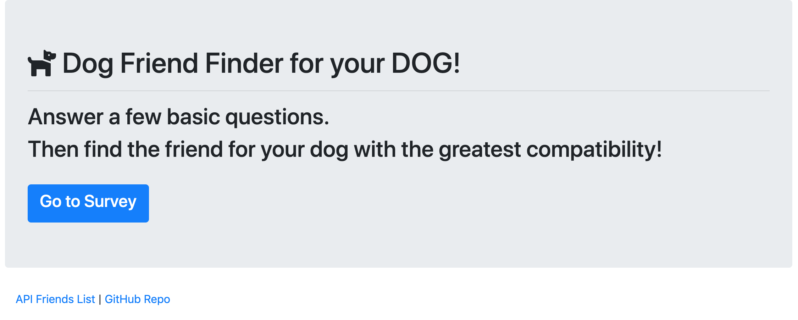
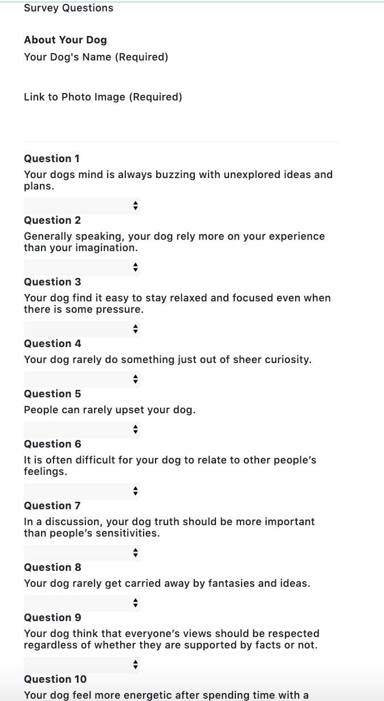
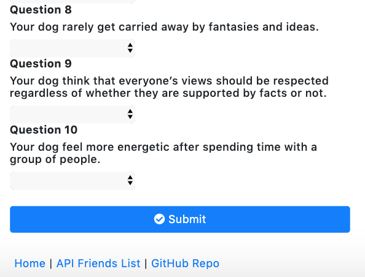
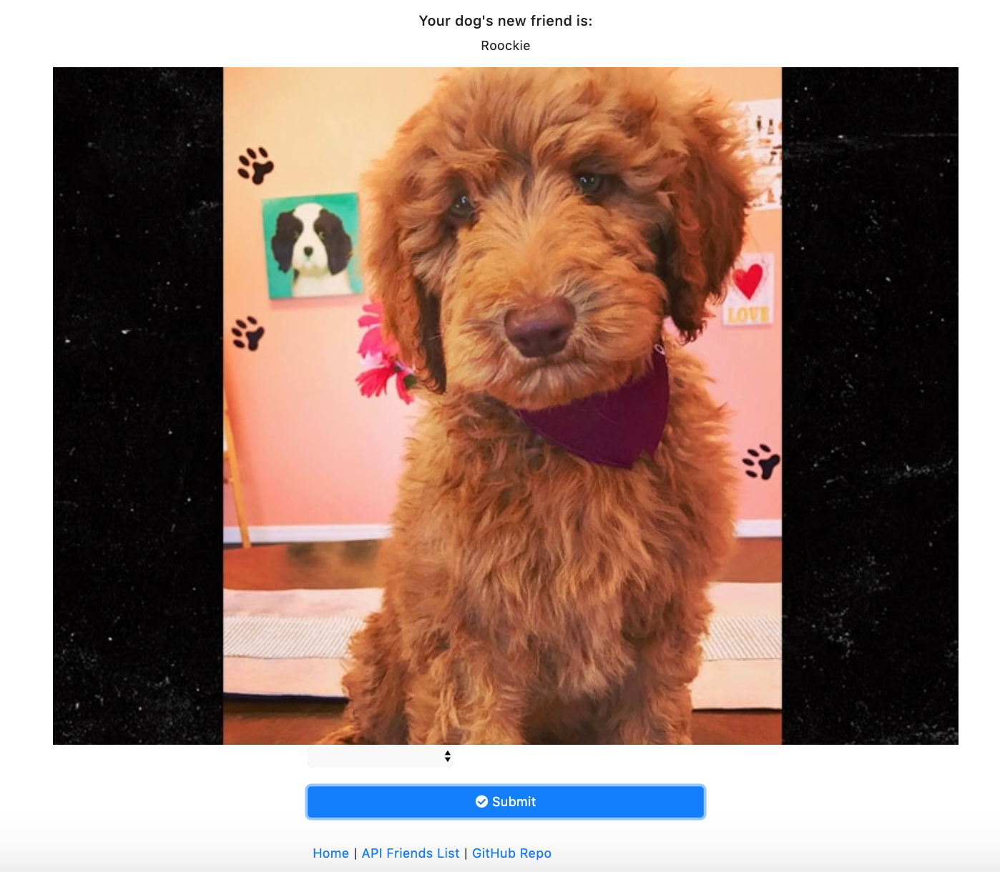
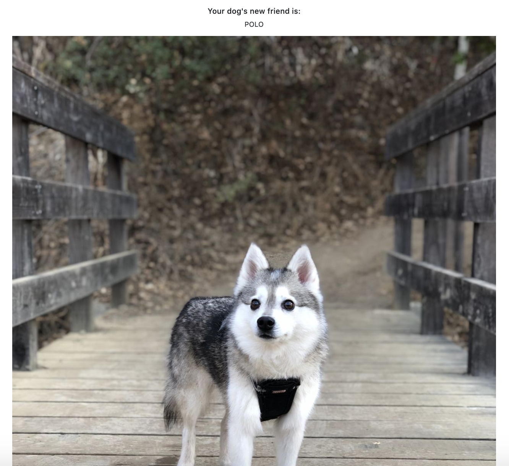
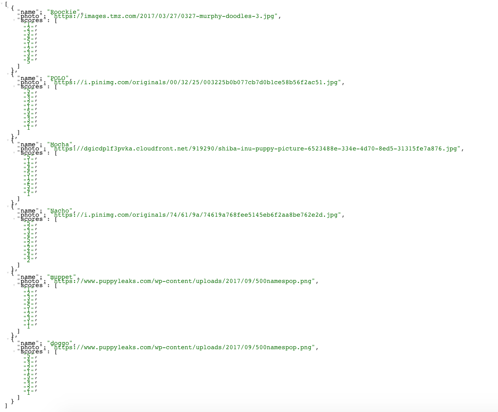

# Friend-Finder

- Deploy link using Heroku: https://dogfriendfinderapp.herokuapp.com/
- NPM: 
    - Express
    - Path
- Bootstrap
- Font Awesome!

Start page 

First part of questions 

Second part of questions 

Result example 1 

Result example 2 

JSON Result 
